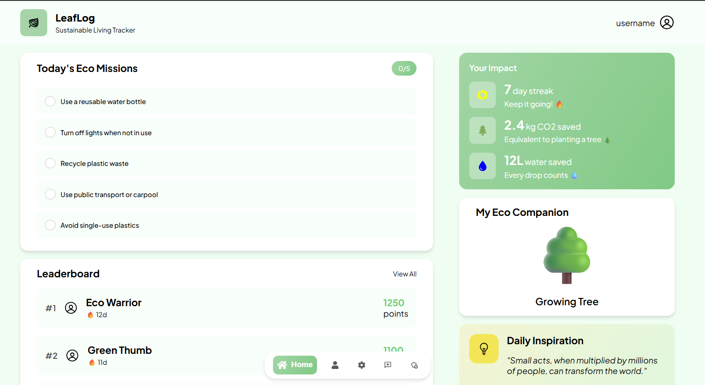
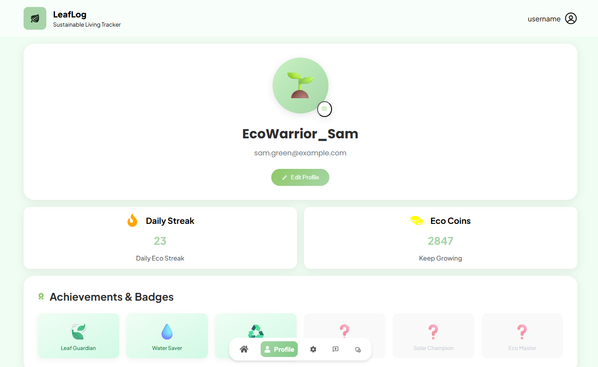
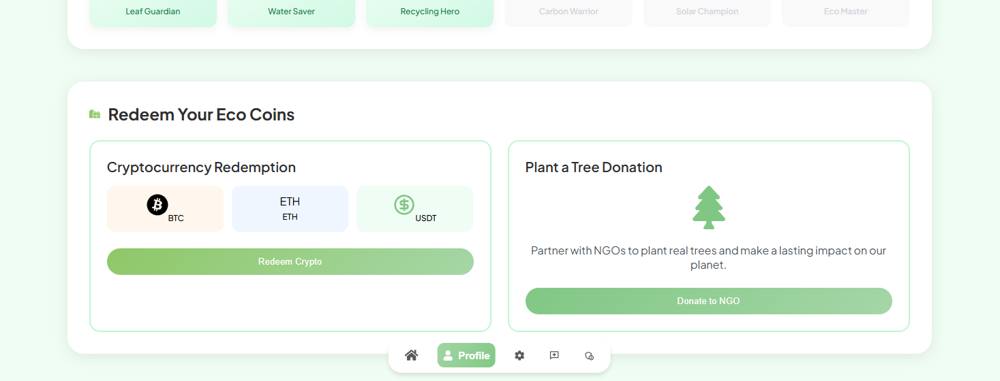
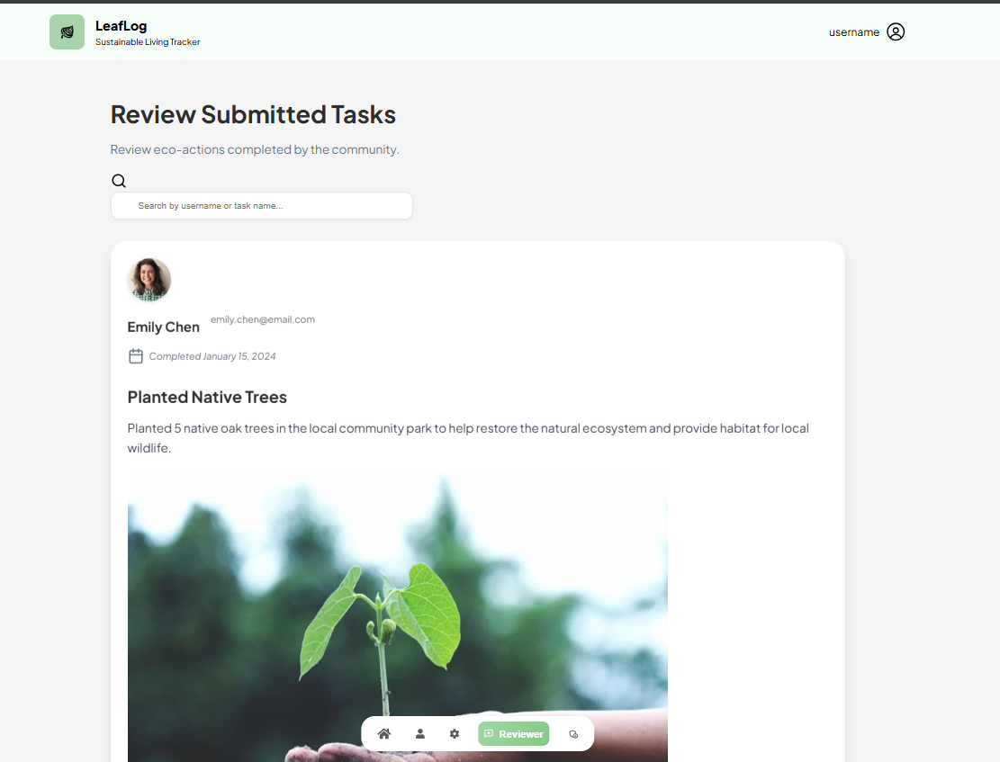

# 🚀 Green Spark Submission

## Project Title
LeafLog 

## Problem Statement Addressed
"Make environmental responsibility fun — using points, leaderboards, and achievements for eco-friendly actions."

## Project Overview
Users log activities like planting trees, recycling, or participating in clean-up drives, and upload proof for review. Reviewers verify submissions, while admins oversee reviewer management and requests.

The platform awards points, badges, and leaderboard rankings to encourage friendly competition and community impact. With its clean, green-themed UI and responsive design, LeafLog turns environmental action into a game everyone can play.

## Key Features
📸 Task Submission with Proof – Users log eco-actions (e.g., tree planting, recycling) with photo evidence.

✅ Reviewer System – Verified reviewers can approve or reject submissions with optional comments.

🛡️ Admin Controls – Admins manage reviewers, approve reviewer requests, and monitor platform activity.

🏆 Gamification – Earn points, badges, and leaderboard rankings to encourage continuous engagement.

🔍 Search & Filtering – Easily find tasks by username or activity type.

📱 Responsive UI – Clean, green-themed interface optimized for desktop and mobile.

## GitHub Repository Link
Frontend: https://github.com/typshi-aswin/leaflog
Backend: https://github.com/NayanUnni95/LeafLogBK

## Team Members & Roles
Naveen S - Team Lead
Nayan SS - Backend
Clifin Cletus - Backend
Aswin V Sivan - Frontend

## Screenshot

Additional Notes (Optional)

Any challenges faced, tech stack used, or future plans.